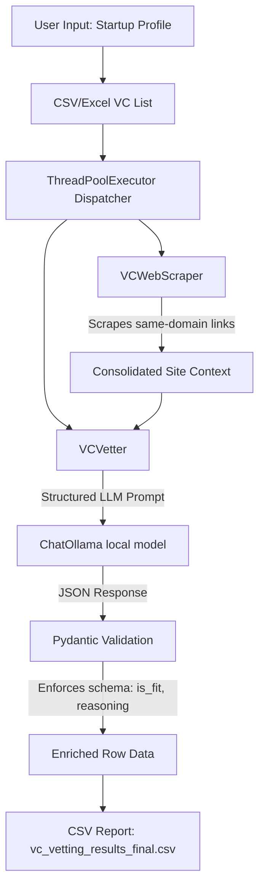

# Corporate VC Vetting Agent

A professional, modular, parallelized command-line utility to determine investment fit between a startup and a list of Corporate Venture Capital (CVC) firms. 

The tool crawls VC websites, extracts investment thesis details, and uses a local Large Language Model (via Ollama) with validated Pydantic structured outputs to assess compatibility.

---

## Architecture Flow



---

## Key Features

- **Production-Grade Architecture**: Clean, modular Python package (`vc_vetter`).
- **Structured LLM Outputs**: Structured JSON output from Ollama.
- **Efficient Scraper**: A robust crawler class that resolves relative paths, rotates user-agents, strips boilerplate tags (header/footer/nav/scripts), and traverses relevant links in a single pass (maximum 1 request per page).
- **Parallel Processing**: Uses Python's `ThreadPoolExecutor` to vet multiple VCs concurrently, reusing a single shared ChatOllama instance to prevent local memory overhead.
- **Professional Log Management**: Directs background crawling and API logs to a dedicated log file (`vc_vetter.log`) to keep the CLI output clean and prevent inter-thread logs from disrupting the progress bar.
- **Validated Tests**: Unit test suite using `pytest` and mocks to verify scraper crawling and model vetting without hitting network or running local LLMs.

---

## Directory Structure

```
vc-classifier/
├── .gitignore          # Git exclusion rules
├── pyproject.toml      # Modern PEP 518/621 package metadata & configuration
├── requirements.txt    # Frozen dependency manifest
├── README.md           # Documentation
├── main.py             # App entrypoint
├── vc_vetter/          # Core package
│   ├── __init__.py     # Package initialization and exports
│   ├── config.py       # Configuration management (Settings class)
│   ├── scraper.py      # Crawler and HTML text extractor
│   ├── vetter.py       # LangChain wrapper & Pydantic structured output definitions
│   └── cli.py          # User prompt loop, file input, and parallel thread runner
└── tests/              # Testing suite
    ├── __init__.py
    ├── test_scraper.py # Web scraping unit tests
    └── test_vetter.py  # Model vetting & prompt parsing tests
```

---

## Prerequisites

1. **Python 3.9+** installed.
2. **Ollama** installed and running locally. Download it from [ollama.com](https://ollama.com).
3. **Local LLM Model** pulled. By default, this tool uses `llama3`. Download it using:
   ```bash
   ollama pull llama3
   ```

---

## Installation & Setup

1. **Clone & Navigate**:
   ```bash
   cd "VC classifier"
   ```

2. **Initialize Virtual Environment**:
   ```bash
   python3 -m venv .venv
   source .venv/bin/activate
   ```

3. **Install Dependencies**:
   ```bash
   pip install -r requirements.txt
   ```

---

## Usage

1. Start your local Ollama server (ensure `ollama` is in your background tasks or run `ollama serve`).
2. Run the entrypoint script:
   ```bash
   python main.py
   ```
3. Enter your startup details when prompted.
4. Input the path to your VC dataset (e.g., `Investor Sample list.csv` or `CVC investors - CVC.csv`).
5. Track progress in the CLI progress bar. Technical details and warnings will be logged in `vc_vetter.log`.
6. Once complete, check the generated report at `vc_vetting_results_final.csv`.

---

## Configuration Settings

You can override default settings by setting environment variables in your terminal:

| Variable | Description | Default Value |
|---|---|---|
| `VC_LLM_MODEL` | Ollama model to invoke | `llama3` |
| `VC_MAX_WORKERS` | Threads to run concurrently | `10` |
| `VC_MAX_PAGES` | Max pages to crawl per VC | `5` |
| `VC_SCRAPE_TIMEOUT` | Scraper timeout per HTTP request | `15.0` |
| `VC_MAX_CONTENT_LENGTH` | Character limit for consolidated context | `15000` |

*Example override:*
```bash
export VC_LLM_MODEL="mistral"
export VC_MAX_WORKERS=5
python main.py
```

---

## Development and Testing

Run the test suite using `pytest` to verify crawler matching and parser schemas:
```bash
pytest
```
